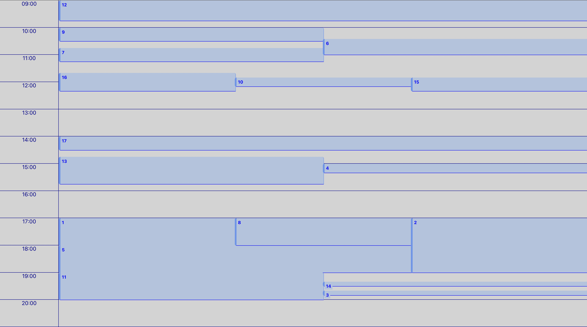

# Rendering events

This component displays events throughout a day while managing the overlap between two or more events. Tests are implemented in this project.



## Stack technique


## Installation

```bash
npm install
```

## Run the application locally

---

```bash
npm start
```

#### URL `http://localhost:3000/`

## Running tests

```bash
npm test
```

---

## Features

- Events can overlap within the same time slot. The overlap of 2 events does not prevent their visibility.
- Each event occupies the maximum width.

## Data Persistence

- Data is stored in `public/input.json`.
- The data is represented by an array of events.
- An event is represented as follows:
  ```javascript
  {
      id: 1,
      start: '15:00', // The event starts at 03:00 pm
      duration: 90 // The duration is expressed in minutes
  }
  ```

## Areas for Improvement

- Display the indicator of the current time.
- Optimize performance by using hooks that allow it.
- Make the component more configurable.
- Improve test coverage.
